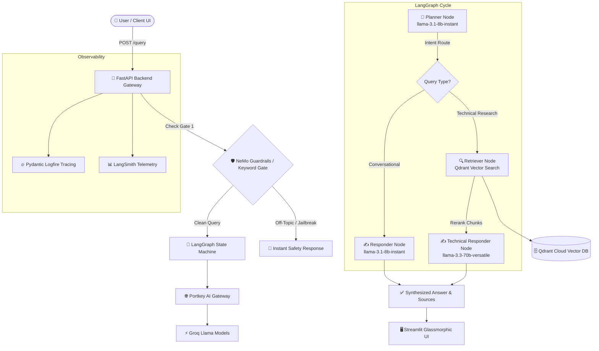

# ⚡ Enterprise Agentic RAG System (Nexus OS)

[](https://python.org)
[](https://fastapi.tiangolo.com)
[](https://streamlit.io)
[](https://langchain.com)
[](https://qdrant.tech)
[](https://portkey.ai)
[](https://render.com)

An enterprise-grade, stateful **Agentic Retrieval-Augmented Generation (RAG)** system designed for high-precision technical documentation queries (Kubernetes, Intel hardware acceleration, and enterprise networking). 

Powered by **LangGraph state machines**, **Portkey AI Gateway**, **Qdrant Vector Database**, **NeMo Guardrails**, **Pydantic Logfire observability**, and a **futuristic Glassmorphism Streamlit UI**.

---

## 🌐 Live Production Endpoints

| Service / Component | Live Production URL | Status |
|---|---|---|
| **🚀 Backend API Base** | [`https://enterprise-rag-api-amgm.onrender.com`](https://enterprise-rag-api-amgm.onrender.com) | `Active` |
| **⚡ Health Check Probe** | [`https://enterprise-rag-api-amgm.onrender.com/healthz`](https://enterprise-rag-api-amgm.onrender.com/healthz) | `200 OK` |
| **👁️ Live Workflow Graph** | [`https://enterprise-rag-api-amgm.onrender.com/graph`](https://enterprise-rag-api-amgm.onrender.com/graph) | `PNG Render` |
| **🖥️ Frontend Interface** | [`https://kubernetes-rag.streamlit.app`](https://kubernetes-rag.streamlit.app) | `Active` |

---

## 📸 Interface Screenshots

### Futuristic Cyberpunk Glassmorphic Dashboard


### Live Query Execution & Retrieved Vector Chunks


---

## 🧠 System Architecture & Workflow



---

## Key Features & Highlights

* ⚡ **Multi-Tier Model Routing**:
  * **Sub-Second Intent Classification**: Uses `llama-3.1-8b-instant` (~0.3s) for intent planning and conversational chit-chat.
  * **Deep Technical Synthesis**: Uses `llama-3.3-70b-versatile` (~1.8s) for technical document synthesis.
* 🧠 **Stateful Context Memory**: Built-in LangGraph `MemorySaver` checkpointer maintaining thread-based multi-turn conversation history (`thread_id`).
* 🛡️ **Multi-Layer Safety Rails**: NVIDIA NeMo Guardrails + keyword-based instant safety gate preventing off-topic queries and prompt injection.
* 🌐 **Portkey AI Gateway**: Unified LLM proxy with fallback strategies, rate limiting, cost tracking, and response caching.
* 🗄️ **High-Precision Vector Retrieval**: Qdrant Cloud vector search paired with FlashRank semantic cross-encoder reranking.
* 🎨 **Futuristic UI Aesthetics**: Cyberpunk dark glassmorphic Streamlit interface with neon status badges, live pulse dots, interactive prompt recommendation chips, and streaming typewriter output.
* 📊 **End-to-End Observability**: Full distributed tracing via **Pydantic Logfire** and **LangSmith**.

---

## 📁 Repository Structure

```text
scalable rag/
├── app/
│   ├── main.py                   # FastAPI REST API entry point (CORS, lifespan, /query, /healthz, /graph)
│   ├── config.py                 # Centralized settings & environment variables
│   ├── agents/
│   │   ├── graph.py              # LangGraph StateGraph & MemorySaver checkpointer
│   │   ├── state.py              # AgentState TypedDict definition
│   │   └── nodes/
│   │       ├── planner.py        # Intent classification node (llama-3.1-8b-instant)
│   │       ├── retriever.py      # Qdrant search & reranking node
│   │       └── responder.py      # Response synthesis node (llama-3.3-70b-versatile)
│   ├── gateway/
│   │   └── client.py             # Portkey AI Gateway & ChatGroq LLM factory
│   ├── guardrails/
│   │   └── rails.py              # NeMo Guardrails & keyword safety gate
│   └── services/
│       └── retrieval/
│           ├── embeddings.py     # Gemini embeddings with retry backoff
│           ├── qdrant_service.py # Qdrant Cloud vector search client
│           └── ranking_service.py# Memory-safe semantic reranking
├── ui/
│   ├── app.py                    # Local Streamlit UI application
│   └── st_cloud_ui.py            # Production Streamlit Community Cloud UI application
├── images/                       # UI screenshots and visual assets
├── docs/                         # Deployment & architecture documentation
├── Dockerfile                    # Multi-stage production Dockerfile (FastAPI Backend)
├── Dockerfile.ui                 # Production Dockerfile (Streamlit UI)
├── render.yaml                   # 1-Click Render Blueprint infrastructure manifest
├── requirements.txt              # Production Python runtime dependencies
└── .env.example                  # Environment variable key template
```

---

## ⚙️ Local Development Setup

### 1. Prerequisites
* Python 3.11+
* Git
* Virtual Environment tool (`venv`)

### 2. Installation
```bash
# Clone the repository
git clone https://github.com/pranjalgupta0280/kubernetes_rag.git
cd kubernetes_rag

# Create virtual environment
python -m venv .venv
source .venv/bin/activate  # On Windows: .venv\Scripts\activate

# Install dependencies
pip install --upgrade pip setuptools wheel
pip install --prefer-binary -r requirements.txt
```

### 3. Environment Configuration
Copy `.env.example` to `.env` and fill in your API keys:
```bash
cp .env.example .env
```

```ini
GEMINI_API_KEY=your_gemini_api_key
QDRANT_CLUSTER_ENDPOINT=https://your-qdrant-url.qdrant.tech
QDRANT_API_KEY=your_qdrant_api_key
GROQ_API_KEY=gsk_your_groq_api_key
PORTKEY_API_KEY=your_portkey_api_key
LOGFIRE_TOKEN=your_logfire_token
```

### 4. Run the Backend API
```bash
uvicorn app.main:app --reload --port 8000
```
* API Docs: [`http://localhost:8000/docs`](http://localhost:8000/docs)
* Health Check: [`http://localhost:8000/healthz`](http://localhost:8000/healthz)

### 5. Run the Streamlit Frontend UI
```bash
streamlit run ui/app.py
```
Open [`http://localhost:8501`](http://localhost:8501) in your browser.

---

## 📡 API Endpoint Reference

### `POST /query`
Executes the RAG agent workflow for a prompt.

**Request Header**: `Content-Type: application/json`  
**Request Body**:
```json
{
  "q": "What is Kubernetes pod scheduling?",
  "thread_id": "user_session_99"
}
```

**Response (200 OK)**:
```json
{
  "question": "What is Kubernetes pod scheduling?",
  "answer": "Kubernetes pod scheduling refers to the process of assigning a pod to a node in the cluster where it can run...",
  "thought_process": [
    "Intent: Technical",
    "Search Term: Kubernetes pod scheduling",
    "Context Retrieved"
  ],
  "status": "Response generated.",
  "sources": [
    "CONTENT: Pod scheduling is handled by the kube-scheduler..."
  ]
}
```

---

## 🚀 Live Cloud Deployment

### 1. Backend API (Render.com)
* **Environment**: `Python 3`
* **Python Version**: `3.11.8`
* **Build Command**: `pip install --upgrade pip setuptools wheel && pip install --prefer-binary -r requirements.txt`
* **Start Command**: `python -m uvicorn app.main:app --host 0.0.0.0 --port $PORT`

### 2. Frontend UI (Streamlit Community Cloud)
* **Main File Path**: `ui/st_cloud_ui.py`
* **Secrets (TOML)**:
  ```toml
  BACKEND_URL = "https://enterprise-rag-api-amgm.onrender.com"
  ```

---

## 📄 License
Distributed under the MIT License. See `LICENSE` for details.
